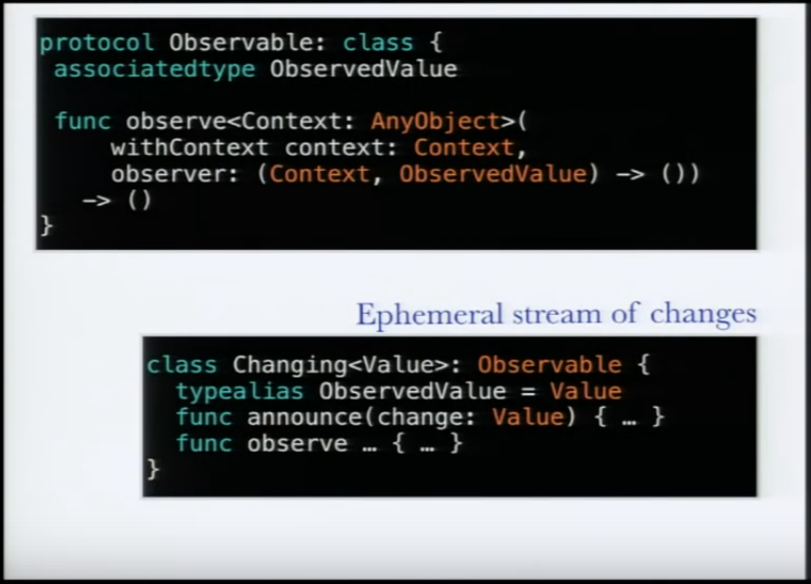
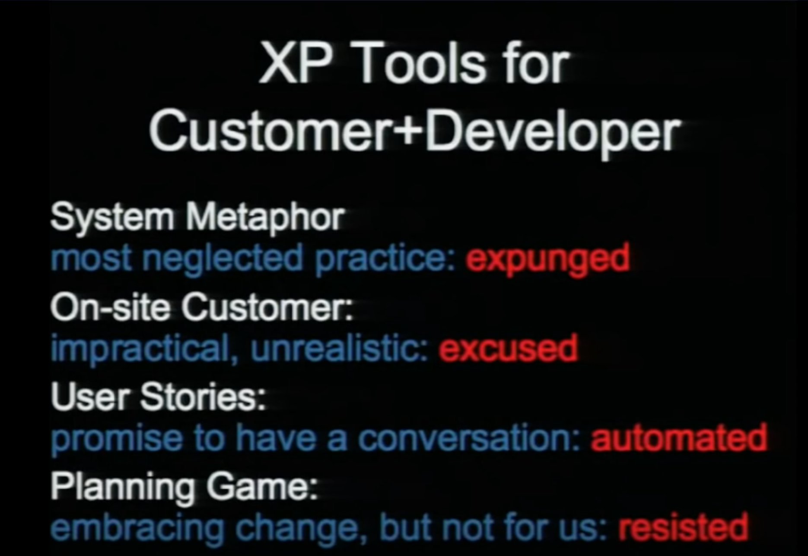

<!-- .slide: data-background="./resources/curry-on-logo.jpg" -->
# Curry On

## Rome! 2016

> Academia and industry need to have a talk.

> Or rather, they just need to talk in general.

Notes:
2 Min Chill: https://www.youtube.com/watch?v=Q2Ulgu7HahI

Conference Website: http://www.curry-on.org/2016/

Recorded Talks: https://www.youtube.com/channel/UC-WICcSW1k3HsScuXxDrp0w

I prepared 6 slides each for one particularly interesting talk.

Then I will recommend and go over a list of even more talks.

And then there are still more talks on the website.

In the end we will decide, if we have a part 2 of this or if we continue in some other format or not continue at all: *Power to the people!*


<!-- .slide: data-background="./resources/boeing-737-max.jpg" -->
## How To Win Big With Old Ideas

- Lisp `=>` REPL
- Trees `=>` immutability at low costs for all
- Datalog `=>` flexible modeling but with relational queries
- Regular Expressions `=>` declarative contracts, property-based tests, docs

<br>

### Eco-System

- figwheel `=>` live-coding
- parinfer `=>` parenthesis completion
- re-natal `=>` iOS development

Notes:
Abstract: http://www.curry-on.org/2016/sessions/how-to-win-big-with-old-ideas.html

Video: https://www.youtube.com/watch?v=JlgVSt-WWkA

Show off REPL/ClojureScript with [Mancy](http://mancy-re.pl/)

Clojure is successful:

- Symbiotic language: Java, JavaScript
- »Go with the flow»
- Simple features which can be communicated easily

> The onboard diagnostic system designed for the Boeing 737 MAX checks and reports on over 6,000 faults, giving airplane technicians and maintenance crew a critical window to the health and performance of the aircraft.

Quote from http://clojurewest.org/speakers#ddolby as mentioned by Matthias Felleisen.


<!-- .slide: data-background="./resources/uncharted-4.jpg" -->
### The Racket Manifesto


Notes:
Abstract: http://www.curry-on.org/2016/sessions/the-racket-manifesto.html

Video: https://www.youtube.com/watch?v=-cLI3GHvLOM

Uncharted: https://con.racket-lang.org/2013/

Language unites other languages like English combines different topics

How does English do it? Context?!

In every Verizon switch

Boing

Show off REPL with Dr. Racket und http://racket-lang.org/


<!-- .slide: data-background="./resources/senior-exercise.jpg" -->
### Exercises in Programming Style

> How to divide the problem and put it back together

## *ex. 1* - [Code](https://raw.githubusercontent.com/crista/exercises-in-programming-style/master/03-monolith/tf-03.py)  - [Style](https://github.com/crista/exercises-in-programming-style/tree/master/03-monolith)
## *ex. 2* - [Code](https://github.com/crista/exercises-in-programming-style/blob/master/04-cookbook/tf-04.py)  - [Style](https://github.com/crista/exercises-in-programming-style/tree/master/04-cookbook)
## *ex. 3* - [Code](https://github.com/crista/exercises-in-programming-style/blob/master/05-pipeline/tf-05.py) - [Style](https://github.com/crista/exercises-in-programming-style/tree/master/05-pipeline)

Notes:
Abstract: http://www.curry-on.org/2016/sessions/exercises-in-programming-style.html

Video: https://www.youtube.com/watch?v=JlPMOszyjjo

- 3,4-years undergrads' code really bad/ugly
- What do we teach?
- Inspired by Raymond Queneau's »Exercises in Style«
- The same story in 99 versions
- Her story: Count occurences of words in a file
- In 33 versions
- Constraints lead to style: »Cannot load the whole file into memory. Hence write a loop.«
- Teach about »styles« <=> »constraints« relation (y, y not, etc.)
- Matthias Felleisen mentions research: CEOs say programmers which suffered through the most paradigm shifts are the best


<!-- .slide: data-background="./resources/dining.jpg" -->
### What is programming

[...](https://github.com/joaomilho/what-is-programming-curry-on#dining-philosophers)

> It appears that there is no consensus on what programming is about. It seems reasonable to be so, after all it is an activity that exist for a relatively short period of time.

> In this time, it changed the way we perform almost all of our other activities and it carries no smaller promises than virtual worlds and AI.

Notes:
Read »Dining philosophers« out loud.

Content: https://github.com/joaomilho/what-is-programming-curry-on

Video: https://www.youtube.com/watch?v=xOOkc8xI06E

paradigm | ontology | knowledge | method | department

- scientific | [mental] process	| law-like	| empirical	| science
- rationalist | mathematical object	| a priori, certain	| deduction	| math
- technocratic | artifact | a posteriori, probable | design | engineering


<!-- .slide: data-background="./resources/portal.jpg" -->


### It's the End of the World as We Know It, and I Feel Fine

- Perl 6, 15 yrs in the making
- 361 suggestions in 2000
- Ignored solutions
- Started by trying to understand the *pain*
- »Learn as you go«
- forgiveness > permission
- gradually typed, extensible, features implemented in perl,...

Notes:
Abstract: http://www.curry-on.org/2016/sessions/its-the-end-of-the-world-as-we-know-it.html

Video: https://www.youtube.com/watch?v=BJIfPFpaMRI

rosettacode.org


<!-- .slide: data-background="./resources/half-life-2-logo.png" -->
### Part II

> Curry on, and on, and...

Notes:
2 Min Chill: https://www.youtube.com/watch?v=Q2Ulgu7HahI

Conference Website: http://www.curry-on.org/2016/

Recorded Talks: https://www.youtube.com/channel/UC-WICcSW1k3HsScuXxDrp0w

I prepared 3 more slides each for one particularly interesting talk.

Then I will recommend and go over a list of even more talks.

And then there are still more talks on the website.

In the end we will decide, if we have a part 3 of this or if we continue in some other format or not continue at all: *Power to the people!*... (AGAIN!)


<!-- .slide: data-background="./resources/mozilla-research.jpg" -->
### Building an Open-Source Research LAB

- Compatibility moves mountains. [asm.js](http://asmjs.org/)
- Silicon Valley Disruption is powered by *Don't break the web*.
- Law of adoption: Worse is better. [WebAssembly](https://webassembly.github.io/)
- Law of lifecycle: [The Hungry Beast and the Ugly Baby](https://www.youtube.com/watch?v=LafDex0L7FM). [Rust](https://www.rust-lang.org/)
- Law of community: [Why Wasn't I Consulted?](http://www.ftrain.com/wwic.html)
- Law of ecosystem: Invariants are shared values.

Notes:
Abstract: http://www.curry-on.org/2016/sessions/building-an-open-source-research-lab.html

Video: https://www.youtube.com/watch?v=9OHcJzJQ2Nk

Author of »Effective JavaScript«, http://effectivejs.com/.

»Worse is better« by Richard P. Gabriel, https://en.wikipedia.org/wiki/Worse_is_better

[...] there is a point where less functionality ("worse") is a preferable option ("better") in terms of practicality and usability. Software that is limited, but simple to use, may be more appealing to the user and market than the reverse.

Ed Catmull: The Hungry Beast and the Ugly Baby, https://www.youtube.com/watch?v=LafDex0L7FM

Unknown, creative, wild, fragile vs. organized/makin-money

Law of ecosystem: Spreading values (e.g. best practices) in the community are great invariants


### A Type is Worth a Thousand Tests


- Swift will be mainstream, since it's the official language for *iDevelopment*
- Swift encourages typed functional programming

Notes:
Abstract: http://www.curry-on.org/2016/sessions/a-type-is-worth-a-thousand-tests.html

Video: https://www.youtube.com/watch?v=q1Yi-WM7XqQ

Author of »Haskell - Functional Programming Lab«, https://itunes.apple.com/us/app/haskell-functional-programming/id841285201?mt=12.

Built the first Swift app to appear on the app store.

Usually he is the Haskell-guy.

In this talk he talks about Swift's type system.

He focuses on the following two concepts: Value types & Protocols with associated types.

We will only really cover value types here.


## Value types: Structs

### Immutable model

```swift
struct Item {
  var name: String
  var done: Bool
}
```

Notes:
Avoid accidental changes of model state (value types vs. reference types)

Avoid races on concurrent threads


## Value types: Enums with associated values

### UI state machines

```swift
enum UIState {
    case display
    case editing(activeItems: [Bool])
}
```

Notes:
Avoid inconsistent state changes

Avoid non-exhaustive transitions

Haskell/ML: These things are called *immutable algebraic data types*

Now, of course with everything being immutable, how can we ever change our UI?


## Protocols with associated types

### Structured change propagation


Notes:
Flow of changes explicit in code

Changes can be processed with combinators (map, fold, accumulate, and so on)


<!-- .slide: data-background="./resources/clones.png" -->
## Notes on post-modern programming

### A whole world of programs

- 50 yrs of software
- 30 yrs of *software engineering* (NATO Conference)
- First NATO Software Engineering Conference: [1968](http://homepages.cs.ncl.ac.uk/brian.randell/NATO/NATOReports/)
- Software is everywhere

> Software succeeded?

Notes:
Abstract: http://www.curry-on.org/2016/sessions/notes-on-post-post-modern-modern-programming.html

Video: https://www.youtube.com/watch?v=a5Q7td6t-iw

Gave this talks more than 3? times.

Always the same slides.

Planes, cars, street lights

Software succeeded: Everybody who attended the first NATO conference on software engineering would say so.

Talks about history and the state or states of software engineering.


### The truth about software development
[excerpt](https://youtu.be/a5Q7td6t-iw?t=21m11s) till minute 23


Notes:
Interesting question from the audience at the end of the talk.

https://youtu.be/a5Q7td6t-iw?t=34m55s

> Sometimes I wonder if architects ever use CS metaphors at their conferences

Response: They do not only use these metaphors, they are turning into computer scientists.


### Other Talks Recommened
- [Notes on Post-Post-Modern-Modern Programming](http://www.curry-on.org/2016/sessions/notes-on-post-post-modern-modern-programming.html)
- [A brief and incomplete history of programming languages](http://www.curry-on.org/2016/sessions/a-brief-and-incomplete-history-of-programming-languages.html)
- [Are We Ready for Secure Languages?](http://www.curry-on.org/2016/sessions/are-we-ready-for-secure-languages.html)
- [Redesigning Type Systems for Industry OO](http://www.curry-on.org/2016/sessions/redesigning-type-systems-for-industry-oo.html)
- [Doing data science with Clojure: the ugly, the sad, the joyful](http://www.curry-on.org/2016/sessions/doing-data-science-with-clojure.html)
- [Sieve: Cryptographically Enforced Access Control for User Data in Untrusted Clouds](http://www.curry-on.org/2016/sessions/sieve-cryptographically-enforced-access-control.html)
- [...](http://www.curry-on.org/2016/#program)
- [still time?](https://github.com/HotDrink/hotdrink)


### Discussion Time


Notes:
- Will there be a part III to this talk/survey?
- Somebody else from the team with a talk? (Could be about a book, framework, past experience,...)
- Developmental Breakfast Revival?
- Use time from »Weekly Recap« (1 hour a week).


### Empty slide for concentration
> ahh ...this is nice
